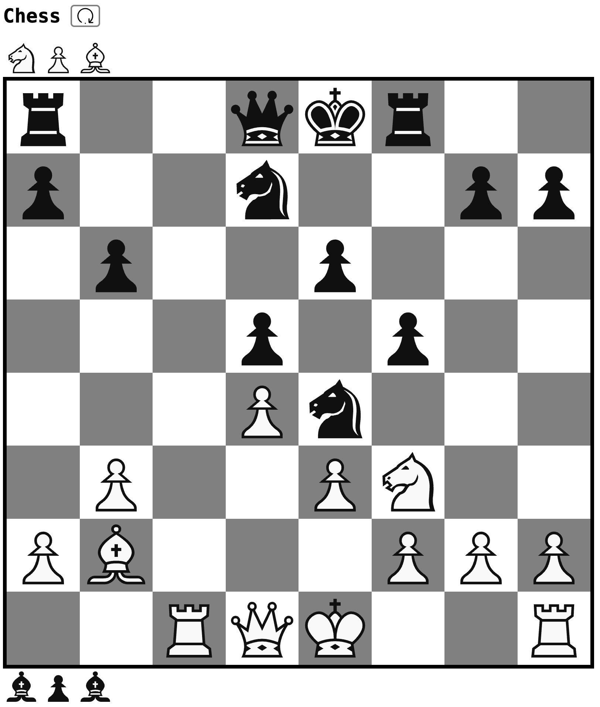

# Chess
- Basic web chess game
- Locally saved game state


## Build
To build Typescript files
```sh
npm install
npx tsc
```
Open `index.html` in a browser or start a http server (e.g. `python -m http.server 3000`).
